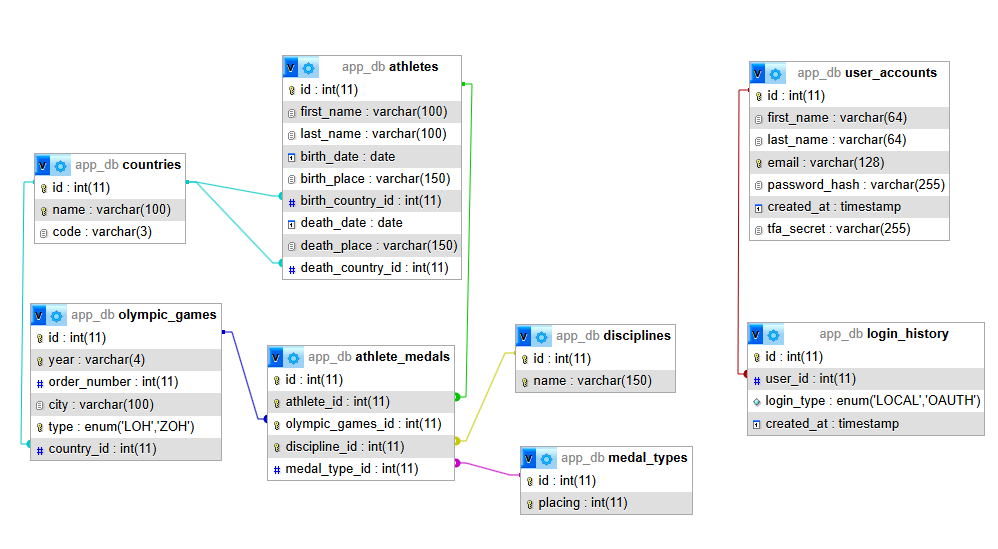

# FOR SERVER PROD VERSION NEED TO INSTALL COMPOSER
via composer:
- 2FA knižnica - knižnica pre 2FA
- Bacon QR Code - knižnica pre generovanie QR kódov pre 2FA
- Google PHP API Client Library - knižnica pre prácu s Google API službami

# TODO:
1) forgot_password add code and logic
2) add config to prod version:
Adresár vendor by nemal byť prístupný z webového prehliadača. Na tento účel si môžeme do Nginx Virtual Host Configuration doplniť pravidlo, ktoré k nemu explicitne zakazuje prístup:
...
location ~* /vendor/ {
    deny all;
    return 403;
}
...
3) Súbor composer.json pre beh stránok nie je potrebný. Preto sa musí nachádzať v odovzdanom ZIP archíve a vo vašom lokálnom/remote repozitári, kde máte vývojovú verziu aplikácie - slúži na aktualizáciu a reinštaláciu existujúcich balíkov. V produkčnom prostredí nemá čo robiť a pri nasadzovaní riešenia na server ho nezabudnite zo serveru vymazať.
4) 
change in google oath  https://console.cloud.google.com/auth/clients/create?authuser=3&organizationId=0&project=olympic-games-489817
Redirect URI je možné hocikedy zmeniť alebo upraviť. Efekt sa ale môže prejaviť až neskôr. Ak niečo nefunguje, Google to väčšinou vypíše priamo v prehliadači, kde je chyba a je potrebné si skontrolovať, či presmerujem používateľa naozaj tam, kam som zadal v Google konzole.
5) reed the whole code. Understand JQuery, Dtatables,Bootstrap, PDO

# NOT IMPLEMENTED:
1) Implementujte tlaˇcidlo vymazania ´udajov - Pozor! - funkcionalita n´asledn´eho
importu mus´ı ostat’ zachovan´a.


***

## Project: Slovak Olympic Medals Web Application

### Stack
**LEMP** (Linux, Nginx, PHP-FPM, MariaDB) running inside **Docker** (docker-compose). Local dev environment on `localhost:8080`. Frontend uses **Bootstrap 5** and **DataTables 1.13** with jQuery.
***
**libraries:**
- bootstrap
- datatables
- jquery

**fonts-used:**
>     <link rel="preconnect" href="https://fonts.googleapis.com">
>     <link rel="preconnect" href="https://fonts.gstatic.com" crossorigin>

***

### Config changes in prod. version:

***

### Database Schema (`app_db`)


With the following relationships:

```
countries        ← referenced by athletes (birth_country_id/death_country_id) and olympic_games(country_id)
disciplines      ← referenced by athlete_medals (discipline_id)
medal_types      ← referenced by athlete_medals (medal_type_id)
olympic_games    ← referenced by athlete_medals (olympic_games_id)
athletes         ← referenced by athlete_medals (athlete_id)
user_accounts    ← referenced by login_history (user_id)
```

***

### Config

#### `config.php`
- Defines `$hostname`, `$database`, `$username`, `$password` variables (different in Docker and Server env.)
- Contains `connectDatabase(PDO)` function that returns a PDO object
- Check for errors during PDO mapping

***

#### `index.php`
**CSV format accepted:** Single merged CSV with **16 columns**:
```
placing, discipline, name, surname, birth_day, birth_place, birth_country,
death_day, death_place, death_country, oh_type, oh_year, oh_city,
oh_country, oh_order, oh_code
```
With delimiter: `,`.

***
### API's
**Type:** JSON endpoint (produces only JSON, no HTML)
#### `data_general.php`

- Returns:
```
echo json_encode(['data' => $rows]);
```

***
#### `data_athlete.php`

- Returns:
```json
echo json_encode([
    'athlete' => [$athlete],
    'medals'  => $medals
]);
```
- `athlete` is wrapped in `[ ]` array (single-element) because DataTables requires an array as data source
***

***
#### `login_history.php`

- Returns:
```json
echo json_encode(['data' => $rows]);
```
***